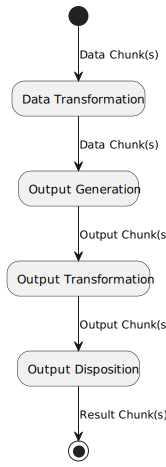
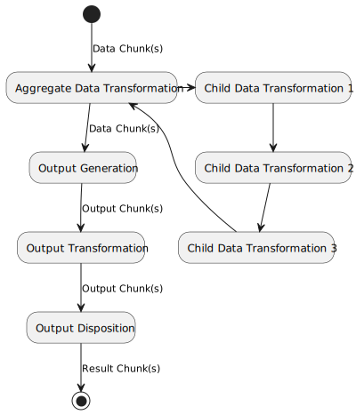
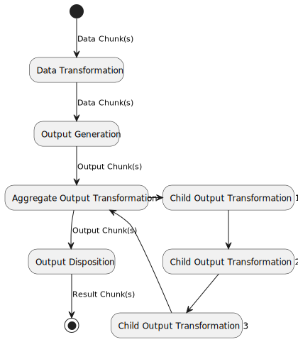
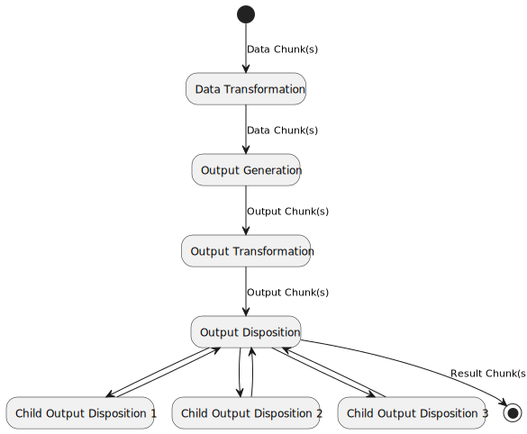

# FormsPipeline

Forms Generation Pipeline

## Background

Most AEM Forms output generation applications take in a data stream, choose a form, merge the form and data to produce output and then send that output somewhere.  This is essentially an [ETL pipeline](https://en.wikipedia.org/wiki/Extract,_transform,_load) (sometimes without the E and/or the L, but sometimes with).

The Forms Generation Pipeline framework's goal is to provide common, reusable framework for building AEM Forms output generation applications.

It has the following additional goals:
* separate client code from reusable code
* minimize the amount of client-specific code required to build an application to just client-specific domain concepts
* force separation of data and output transformation concerns
* provide reusable, tested components
* speed up development of AEM Forms output generation applications

## Conceptual Model

The Forms Generation Pipeline's conceptual model is that a data (or set of data) comes into the system.  An individual piece
of data is referred to as a "chunk" (i.e. it may be standalone or part of a whole).  Each chunk passes through a series of 
transformations before being disposed of.

At its simplest level, this transformation pipeline looks like this:

<div hidden>

```

@startuml SimpleOverview

(*) -->[Data Chunk(s)] "Data Transformation"
-->[Data Chunk(s)] "Output Generation"
-->[Output Chunk(s)] "Output Transformation"
-->[Output Chunk(s)] "Output Disposition"
-->[Result Chunk(s)] (*)

@enduml

```

</div>



Let's examine each step in detail.

### Data Transformation

One or more data "data chunks" are passed into the Data Transformation step.  The data tranformation(s) is/are performed and this produces
one or more (usually different) data chunks which are fed to the next step.

Quite often the data transformations required are complicated and require multiple steps (or are actually multiple transformations).  
In order to accomodate this, the top level Data Transformation step is often an "aggregate" Data Transformation that is a mini-pipeline
that consists of multiple Data Transformation steps.  It's possible, if a little unusual for steps within the aggregate Data Transformation
to themselves be aggregate transformations too.  This allows the top level Data Transformation to be arbitrarily complex while still 
allowing it to built using smaller, simpler, reusable pieces.

<div hidden>

```

@startuml DataOverview

(*) -->[Data Chunk(s)] "Aggregate Data Transformation"
-right-> "Child Data Transformation 1"
--> "Child Data Transformation 2"
--> "Child Data Transformation 3"
--> "Aggregate Data Transformation"
-->[Data Chunk(s)] "Output Generation"
-->[Output Chunk(s)] "Output Transformation"
-->[Output Chunk(s)] "Output Disposition"
-->[Result Chunk(s)] (*)

@enduml

```

</div>




### Output Generation

Output Generation is always a single step that occurs once per data chunk and produces one output chunk.  This is a design limitation.
If you need one data chunk to create two outputs that are the same, then the output chunks should be duplicated in the 
Output Transformation step.  If you need one data chunks to create to different outputs, then a second copy of the data 
will have to be created in Data Transformation step.

The Output Generation step typically calls AEM to merge the data to the form but this is not a requirement.

### Output Transformation

One or more data "output chunks" are passed into the Output Transformation step.  The output tranformation(s) is/are performed and this produces
one or more (usually different) output chunks which are fed to the Output Disposition step.

Like data transformaations, output transformations are often required to be complicated, with multiple steps 
(or are actually multiple transformations).  In order to accomodate this, like the Data Transformation step the top level 
Output Transformation step is often an "aggregate" Output Transformation that is itself a mini-pipeline
that consists of multiple Output Transformation steps.  

Likewise, it's possible, that an aggregate Output Transformation also contains aggregate transformations too.  This allows the 
top level Output Transformation to be arbitrarily complex while still allowing it to built using smaller, simpler, reusable pieces.

<div hidden>

```

@startuml OutputOverview

(*) -->[Data Chunk(s)] "Data Transformation"
-->[Data Chunk(s)] "Output Generation"
-->[Output Chunk(s)] "Aggregate Output Transformation"
-right-> "Child Output Transformation 1"
--> "Child Output Transformation 2"
--> "Child Output Transformation 3"
--> "Aggregate Output Transformation"
-->[Output Chunk(s)] "Output Disposition"
-->[Result Chunk(s)] (*)

@enduml

```

</div>



### Output Disposition

The Output Disposition step is used to send an output chunk to
its final destination.  It could be sent out as an email,
written to an archive system or sent to a printer.

The result of the Output Disposition is then returned as an "result chunk".

It's not uncommon for a top level Output Disposition step to contain logic that then
conditionally delegates to one or more child Output Disposition steps.

<div hidden>

```

@startuml DispositionOverview

(*) -->[Data Chunk(s)] "Data Transformation"
-->[Data Chunk(s)] "Output Generation"
-->[Output Chunk(s)] "Output Transformation"
-->[Output Chunk(s)] "Output Disposition"
"Output Disposition" -down->[Result Chunk(s)] (*)
"Output Disposition" -right-> "Child Output Disposition 1"
--> "Output Disposition"
"Output Disposition" -right-> "Child Output Disposition 2"
--> "Output Disposition"
"Output Disposition" -right-> "Child Output Disposition 3"
--> "Output Disposition"

@enduml

```

</div>



### Chunks

Chunks are the objects that are passed from one step to the next.  
They come in 3 flavours, Data Chunks, Output Chunks and Result Chunks.  Custom classes can implement and extend these
interfaces to provide additional functionality.

Each chunk consist of two parts:
1. The payload - this is usually just the bytes.  In data chunks, this is the data
intended for the next step.  In output chunks, this is the output (or transformed output) from the
output generation step.  Lastly, there are result chunks which contain the results of the output
disposition step.  The payload is generally treated as an opaque object.  If specific elements
of the data need to be accessed, these are usually exposed via the associated context.

1. The contexts - this is metadata and/or information within the data that is available to each
step that processes a chunk.  The context is represented as a set of key/value pairs.  The keys
are always strings and the values can be Java object.  Beyond that there are no restrictions.

#### Contexts

As a chunk passes through the pipeline it accumulates context from previous steps (so a DataChunk has a Data Context, an Output Chunk has a Data Context and an Output Context, and a Result Chunk has a Data, Output and Result Context.)

Chunks can be implemented in ways that pertain to the specific kind of data they hold.  For example, an XML Data Chunk could be designed to
handle XML data.  It could check that the XML data is well-formed.  It may validate that data against a schema and/or it may make data
available via the associated data context (for example, the context keys could be XPath expressions that return text within the associated
XML elements).

Contexts can also be implemented that aggregate other contexts.  These aggregate interfaces can make key/values available in other contexts
available in their own.

